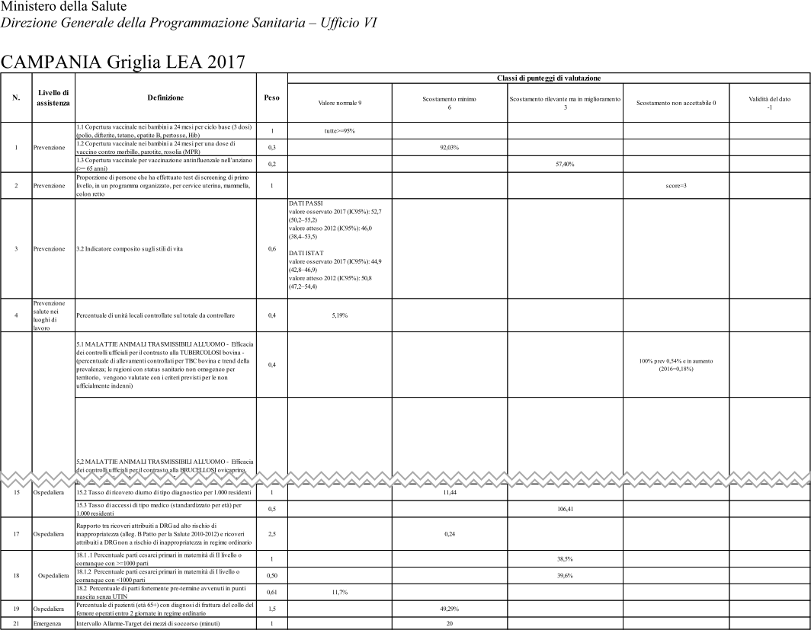

<h1 class="text-blue anim-fade-in">Livelli essenziali di assistenza (LEA): le nostre richieste essenziali</h1>

  <a style="padding-bottom: 10px !important;margin-bottom: 15px;" class="d-block box-shadow-medium px-3 pt-4 pb-6 position-relative rounded-1 overflow-hidden no-underline" href="#">
    

    <h3 class="text-gray-dark">Costituzione italiana - Articolo 32</h3>
    

      "La Repubblica tutela la <strong>salute</strong> come <strong>fondamentale diritto</strong> dell’individuo e interesse della collettività"
    

  </a>

Questo diritto viene garantito erogando i cosìdetti **Livelli essenziali di assistenza** (**LEA**), ovvero le **prestazioni** e i **servizi** che il **Servizio sanitario nazionale** (SSN) **è tenuto a fornire a tutti i cittadini**, gratuitamente o dietro pagamento di una quota di partecipazione (*ticket*), con le risorse pubbliche raccolte attraverso la fiscalità generale (tasse).

I LEA sono definiti nel [Decreto del Presidente del Consiglio dei Ministri (DPCM) del 12 gennaio 2017](http://www.trovanorme.salute.gov.it/norme/dettaglioAtto?id=58669&completo=true), che individua **tre livelli principali**:

- **Prevenzione collettiva e sanità pubblica**, che comprende tutte le attività di prevenzione rivolte alle collettività ed ai singoli;
- **Assistenza distrettuale**, vale a dire le attività e i servizi sanitari e socio-sanitari diffusi sul territorio;
- **Assistenza ospedaliera**.

<h2 class="text-green">Il monitoraggio dei LEA</h2>

> Lo **Stato** ha il **compito** di **determinare** i **Livelli di assistenza** che devono essere garantiti su tutto il territorio nazionale e di **vigilare** sulla loro **effettiva erogazione**

A tale scopo, presso il Ministero della Salute, è stato istituito il **Comitato permanente per la verifica dell'erogazione dei Livelli Essenziali di Assistenza** (Comitato LEA). Questo monitoraggio - fino al 2019 - si effettua grazie all'utilizzo della cosìdetta "[**Griglia LEA**](http://www.salute.gov.it/portale/lea/dettaglioContenutiLea.jsp?lingua=italiano&id=4747&area=Lea&menu=monitoraggioLea)", che consente di conoscere e cogliere nell'insieme la diversità ed il disomogeneo livello di erogazione dei livelli di assistenza. 
I **risultati** della **valutazione** dell'**adempimento "Mantenimento nell'erogazione dei LEA"** dovrebbero essere **presentati annualmente**.

Il Decreto del Ministero della salute del 12 marzo 2019 ha introdotto il "Nuovo Sistema di Garanzia" (NSG), che sostituisce dal 1 gennaio 2020 la "Griglia LEA", con l'obiettivo di verificare secondo le dimensioni dell'equità, dell'efficacia, e della appropriatezza che tutti i cittadini italiani ricevano le cure e le prestazioni rientranti nei LEA.

L'**ultimo *report*** pubblico di **monitoraggio** è [quello per l'anno **2017**](http://www.salute.gov.it/imgs/C_17_pubblicazioni_2832_allegato.pdf), ed è pubblicato come file PDF.

<h2 class="text-red">Cosa chiediamo</h2>

<h3 class="text-orange-light">L'aggiornamento annuale dei report di monitoraggio e la loro pubblicazione</h3>

La valutazione del "Comitato LEA" dell'adempimento del "Mantenimento nell'erogazione dei LEA" non ha un esito pubblico da 2 anni: **mancano i *report* dell'anno 2018 e del 2019**.

La loro pubblicazione è un elemento **essenziale** e **propedeutico** al rispetto del **diritto alla salute**.

<h3 class="text-orange-light">La pubblicazione delle tabelle della griglia LEA in formato machine readable</h3>

> L’obiettivo è creare un Servizio sanitario nazionale che sia sempre **al passo con le innovazioni tecnologiche e scientifiche** e con le esigenze dei cittadini (vedi [presentazione del 2017](http://www.salute.gov.it/imgs/C_17_notizie_2842_listaFile_itemName_0_file.pdf) de "I nuovi livelli essenziali di assistenza").

Chiediamo di pubblicare le **tabelle regionali** delle "**Griglie LEA**" (sotto un esempio) contenute nel monitoraggio annuale ([qui](http://www.salute.gov.it/imgs/C_17_pubblicazioni_2832_allegato.pdf) quello del 2017), anche in formato ***machine readable***. Per tutti gli anni, per cui sono (e saranno) pubblicati report che le contengono.

È **essenziale** infatti potere **analizzare** i **dati delle griglie** nel tempo e anche in **relazione** ad altri dati (sociali, economici, ecc.). La sola pubblicazione in formato PDF lo impedisce.

<h3 class="text-orange-light">La pubblicazione dei report delle riunioni del Comitato LEA</h3>

Lorem ipsum dolor sit amet, consectetur adipiscing elit. Integer faucibus, sem id auctor placerat, sem nibh ultrices erat, ut hendrerit felis diam id nisl. Maecenas placerat nec est vitae consectetur. Etiam vitae hendrerit dui, eget tincidunt augue. Nunc rhoncus pulvinar purus a feugiat. Sed euismod in ligula tincidunt ultrices. **Quisque** et gravida tellus. In hac **habitasse** platea dictumst. Aenean mi mauris, dictum in sagittis ullamcorper, lobortis vitae nisl. Vestibulum efficitur eleifend lacus, ac malesuada lacus volutpat quis. Pellentesque fermentum, enim a tempor dignissim, augue nulla faucibus lectus, a maximus justo lacus vitae tortor. Aliquam in tempor est, vel consequat odio.

Duis et metus tellus. Integer sit amet est non nisl facilisis mattis sed vitae libero. Proin nunc ex, gravida id bibendum lobortis, facilisis sit amet turpis. **Phasellus** laoreet fringilla magna, sollicitudin imperdiet lacus maximus vitae. Ut quis volutpat augue, nec ultricies erat. Vestibulum sodales commodo massa sit amet gravida. Sed eget sem vitae nisl accumsan ornare et in eros. Morbi auctor iaculis condimentum. Fusce vel consequat ligula.
